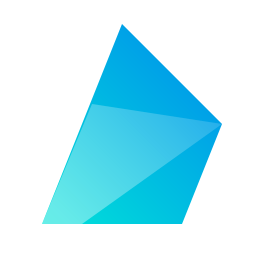

# Fins - Geek New Tab

<p align="center">
  
</p>

<p align="center">
  A clean, minimalist new tab extension. Built with Vue 3, Vite, TypeScript, and co-crafted by Gemini.
</p>

---

## ✨ Features

- **Geek Aesthetics**: Immersive "Glassmorphism" UI with dynamic fluid hover effects.
- **Performance First**: Built on Vite 5+, instant startup, minimal memory footprint.
- **Smart Grid**: Draggable layout system powered by `vuedraggable`.
- **Cloud Sync**: Cross-device synchronization using `LZ-String` compression (supports Chrome/Edge Sync).
- **Privacy Focused**: No tracking, purely local + browser native storage.
- **Customization**: Hex color picker with alpha transparency, Bing Daily wallpapers, or custom URLs.

## 🛠 Tech Stack

- **Framework**: Vue 3 (Script Setup) + TypeScript
- **Build Tool**: Vite + @crxjs/vite-plugin
- **State Management**: Pinia + Persistence Strategy
- **Styling**: Less + CSS Modules
- **Icons**: RemixIcon

## 🚀 Getting Started

### Prerequisites

- Node.js (v16+)
- pnpm (Recommended) or npm/yarn

### Development

1.  **Clone the repo**

    ```bash
    git clone [https://github.com/endfish/fins.git](https://github.com/endfish/fins.git)
    cd fins
    ```

2.  **Install dependencies**

    ```bash
    pnpm install
    ```

3.  **Run in Dev Mode (HMR)**

    ```bash
    pnpm dev
    ```

    This will generate a `dist` folder.

4.  **Load in Browser**
    - Open Chrome/Edge and go to `chrome://extensions`.
    - Enable **Developer mode** (top right).
    - Click **Load unpacked** (加载已解压的扩展程序).
    - Select the `dist` folder in your project root.

### Build for Production

To create a production-ready build (minified code):

```bash
pnpm build
```

## 🤝 Contribution
This project is currently in Beta. Feel free to open issues or submit PRs.

## 📄 License
MIT License © 2025 Endfish
